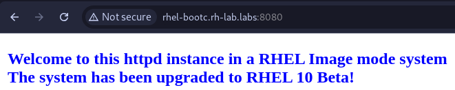

# Use Case - Upgrading a VM based on a bootc image

In this example, we want to add some bits to the [previously generated httpd image](../bootc-container-anaconda-ks/README.md) to upgrade the system from **RHEL 9.5** to **RHEL 10 Beta**.

We will then use **bootc** to manage the system upgrade, and you will see how easy and fast perfoming upgrades is.

The Containerfile in this example will:

- Customize the index file
- Customizes the Message of the day

<details>
  <summary>Review Containerfile.upgrade</summary>
  ```dockerfile
  --8<-- "use-cases/bootc-container-upgrade/Containerfile.upgrade"
  ```
</details>


## Building the image

From the root folder of the repository, switch to the use case directory:

```bash
cd use-cases/bootc-container-upgrade
```

You can build the image right from the Containerfile using Podman:

```bash
podman build -f Containerfile.upgrade -t rhel-bootc-vm:httpd .
```

## Testing the image

You can now test it using:

```bash
podman run -it --name rhel-bootc-vm --hostname rhel-bootc-vm -p 8080:80 rhel-bootc-vm:httpd
```

Note: The *"-p 8080:80"* part forwards the container's *http* port to the port 8080 on the host to test that httpd is working.


The container will now start and a login prompt will appear:


### Testing Apache

On another terminal tab or in your browser, you can verify that the httpd server is working and serving traffic.

**Terminal**

```bash
 ~ curl localhost:8080
```

**Browser**



## Tagging and pushing the image

To tag and push the image you can simply run (replace **YOURQUAYUSERNAME** with the account name):

```bash
export QUAY_USER=YOURQUAYUSERNAME
```

```bash
podman tag rhel-bootc-vm:httpd quay.io/$QUAY_USER/rhel-bootc-vm:httpd
```

Log-in to Quay.io:

```bash
podman login -u $QUAY_USER quay.io
```

And push the image:

```bash
podman push quay.io/$QUAY_USER/rhel-bootc-vm:httpd
```

You can now browse to [https://quay.io/repository/YOURQUAYUSERNAME/rhel-bootc-httpd?tab=settings](https://quay.io/repository/YOURQUAYUSERNAME/rhel-bootc-httpd?tab=settings) and ensure that the repository is set to **"Public"**.


## Updating the VM with the newly created image

The first thing to do is logging in the VM created in the [previous use case](../bootc-container-anaconda-ks/README.md) or any other use case (QCOW, ISO, AMI):

```bash
 ~ ▓▒░ ssh bootc-user@192.168.124.16
bootc-user@192.168.124.16's password:
This is a RHEL 9.5 VM installed using a bootable container as an rpm-ostree source!
Last login: Mon Jul 29 12:03:40 2024 from 192.168.124.1
[bootc-user@localhost ~]$
```

Verify that bootc is installed:

```bash
[bootc-user@localhost ~]$ bootc --help
Deploy and transactionally in-place with bootable container images.

The `bootc` project currently uses ostree-containers as a backend to support a model of bootable container images.  Once installed, whether directly via `bootc install` (executed as part of a container) or via another mechanism such as an OS installer tool, further upgrades can be pulled via e.g. `bootc upgrade`.

Changes in `/etc` and `/var` persist.

Usage: bootc <COMMAND>

Commands:
  upgrade      Download and queue an upgraded container image to apply
  switch       Target a new container image reference to boot
  edit         Apply full changes to the host specification
  status       Display status
  usr-overlay  Add a transient writable overlayfs on `/usr` that will be discarded on reboot
  install      Install the running container to a target
  help         Print this message or the help of the given subcommand(s)

Options:
  -h, --help   Print help (see a summary with '-h')
```

Note that among the options we have the **upgrade** option that we will be using in this use case.
The upgrade option allows checking, fetching and using any upgraded container image corresponding to the *imagename:tag* we used, in this case **quay.io/YOURQUAYUSERNAME/rhel-bootc-vm:httpd**

The upgrade command requires higher privileges to run, let's perform the upgrade!

```bash
[bootc-user@localhost ~]$ sudo bootc upgrade
layers already present: 2; layers needed: 71 (1.5 GB)
Fetching layers ████████████████████ 71/71 
 └ Fetching ████████████████████ 240 B/240 B (0 B/s) layer 3f31bbba8d765173de253
Fetched layers: 1.39 GiB in 3 minutes (6.93 MiB/
Queued for next boot: quay.io/kubealex/rhel-image-mode-demo:app
  Version: 10.20250116.0
  Digest: sha256:4cf5180c3586eaf352661e05399ff23a9a2e021a98acefaabd83b0e991dd21b3
Total new layers: 73    Size: 1.5 GB
Removed layers:   78    Size: 1.5 GB
Added layers:     71    Size: 1.5 GB
```

As you can see, at the beginning it performs a comparison between the actual rpm-ostree image that the system is booted from and the new image, fetching **only the additional layer** corresponding to the upgrades introduced during the last build.

Proceed with a reboot:

```bash
[bootc-user@localhost ~]$ sudo reboot
```

Let's log back in!

```bash
 ~ ▓▒░ ssh bootc-user@192.168.122.19
bootc-user@192.168.122.19's password: 
This is a RHEL VM installed using a bootable container as an rpm-ostree source!
This server is now running on RHEL 10 after the latest upgrade.
Last login: Mon Feb 24 12:15:42 2025 from 192.168.122.1
[bootc-user@localhost ~]$ 
```

You can already see that something changed, we have a new line in our message of the day, let's check the OS version:

```bash
[bootc-user@localhost ~]$ cat /etc/os-release 
NAME="Red Hat Enterprise Linux"
VERSION="10.0 (Coughlan)"
ID="rhel"
ID_LIKE="centos fedora"
VERSION_ID="10.0"
PLATFORM_ID="platform:el10"
PRETTY_NAME="Red Hat Enterprise Linux 10.0 Beta (Coughlan)"
ANSI_COLOR="0;31"
LOGO="fedora-logo-icon"
CPE_NAME="cpe:/o:redhat:enterprise_linux:10::baseos"
HOME_URL="https://www.redhat.com/"
VENDOR_NAME="Red Hat"
VENDOR_URL="https://www.redhat.com/"
DOCUMENTATION_URL="https://access.redhat.com/documentation/en-us/red_hat_enterprise_linux/10"
BUG_REPORT_URL="https://issues.redhat.com/"

REDHAT_BUGZILLA_PRODUCT="Red Hat Enterprise Linux 10"
REDHAT_BUGZILLA_PRODUCT_VERSION=10.0
REDHAT_SUPPORT_PRODUCT="Red Hat Enterprise Linux"
REDHAT_SUPPORT_PRODUCT_VERSION="10.0 Beta"
```

Here we go, our image is upgraded and fully working. Of course we can use the new image to provision similar VMs that need the same pieces of software on them.
