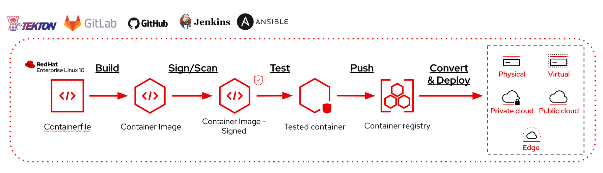

# Simplify Image Mode for RHEL lifecycle management with Automation workflows and CI/CD pipelines

Image mode for Red Hat Enterprise Linux (RHEL) brings container and cloud-native patterns to OS management, and just like containerized applications, image mode benefits greatly from integration with Automation and CI/CD Pipelines.

In this article, we will explore how Image Mode for RHEL fits into CI/CD and automation workflows, and what integrations are available to start automating the build, publish, test, and deploy lifecycle.

---

## Why automation works so well with Image Mode?

Image Mode for RHEL represents a convergence of two automation worlds that have traditionally operated separately: the OS/infrastructure lifecycle and the container image pipeline.
In package mode, automation meant configuration management, applying state to a running system. In Image Mode, the system is the image. That shift means the entire OS lifecycle (building, testing, updating, managing) can now be expressed as a workflow or a pipeline, using the same patterns and toolchain your teams already use for containerized applications.

Each phase of its lifecycle, is made of a set of steps that the users need to do in order to:

- **Build** - Create a new OS container image from a Containerfile
- **Scan and sign** - Run vulnerability scans and sign the container image
- **Publish** - Push the image to a container registry
- **Test** - Validate the image before promoting it
- **Deploy** - Roll out the new image to target systems
- **Configure and maintain** - Perform configurations and maintenance like any other RHEL system

Automating this lifecycle through a CI/CD system or an Automation tool removes manual steps, enforces consistency, and makes OS updates auditable and repeatable.

---

## Available Integrations

A series of Git repositories are available, each aligned to a specific Automation or CI/CD platform - to illustrate how image mode content can be managed in an automated fashion. The following integrations are currently featured:

- **GitHub Actions**
- **GitLab CI**
- **Jenkins**
- **OpenShift Pipelines (Tekton)**
- **Ansible Automation Platform**

All resources are hosted in the [Red Hat Communities of Practice GitLab group](https://gitlab.com/redhat-cop). The **[RHEL Image Mode CICD](https://gitlab.com/redhat/cop/rhel/rhel-image-mode-cicd)** repository is the recommended starting point, as it contains references to each of the available implementations.

??? warning "**Support Policy for Community content**"
    The repositories are open source community projects. They are **not** maintained by Red Hat Engineering and do not include support from the Red Hat Customer Experience and Engagement (CEE) team.
    For production support guidance, refer to [Red Hat's support policy](https://access.redhat.com/support/policy/).

---

## Architectural Principles

Regardless of which platform you use, every implementation is built around a common set of patterns:

- **Accessing entitled packages** - securely consuming RHEL content during image builds
- **Building image mode for RHEL** - producing bootable container images from a Containerfile
- **Interacting with remote container registries** - pushing and pulling images as part of the pipeline
- **Secrets management** - handling credentials (registry tokens, subscriptions) safely within the CI/CD environment
- **Reusing platform features** - leveraging caching, triggers, and native constructs of the underlying CI/CD tool

Each integration may introduce patterns unique to its platform, but the list above is universal across all of them.

---

## Automation and CI/CD use cases

### Building Image mode container images

Building Image Mode container images can follow the same flow application containers, so it is very easy to integrate their build into existing workflows or pipelines.
The examples available show how easy it is to just get started.

### Convert container images and deploy VMs and instances

To deploy Image Mode for RHEL Instances/VMs you need to convert it to a format that can be used by Hypervisors, Cloud providers or Bare Metal servers/devices.
The conversion process leverages a tool, [*bootc-image-builder*](https://github.com/osbuild/bootc-image-builder) that runs as a container, making it 'friendly' to be plugged into existing workflows or pipelines.

### Day 1 and Day 2 operations

Image Mode for RHEL is an alternative to deploy and build RHEL, but the running servers are 100% RHEL servers.
This easily allow to perform the same operations and automations you use for 'package mode' servers.

You can perform configurations, backup your data, connect external mounts, run workloads or batches, exactly like any other server.

Image Mode for RHEL works perfectly with other Red Hat Products, that have full support for it:

- [Red Hat Satellite](https://www.redhat.com/en/technologies/management/satellite)
- [Red Hat Lightspeed](https://www.redhat.com/en/lightspeed)
- [Red Hat Ansible Automation Platform](https://www.redhat.com/en/technologies/management/ansible)
- [Red Hat Edge Manager](https://www.redhat.com/en/resources/simplify-edge-management-at-scale-detail)

From content management, including container registry capabilities in Satellite, to proactive remediation suggestions and automation at scale.
