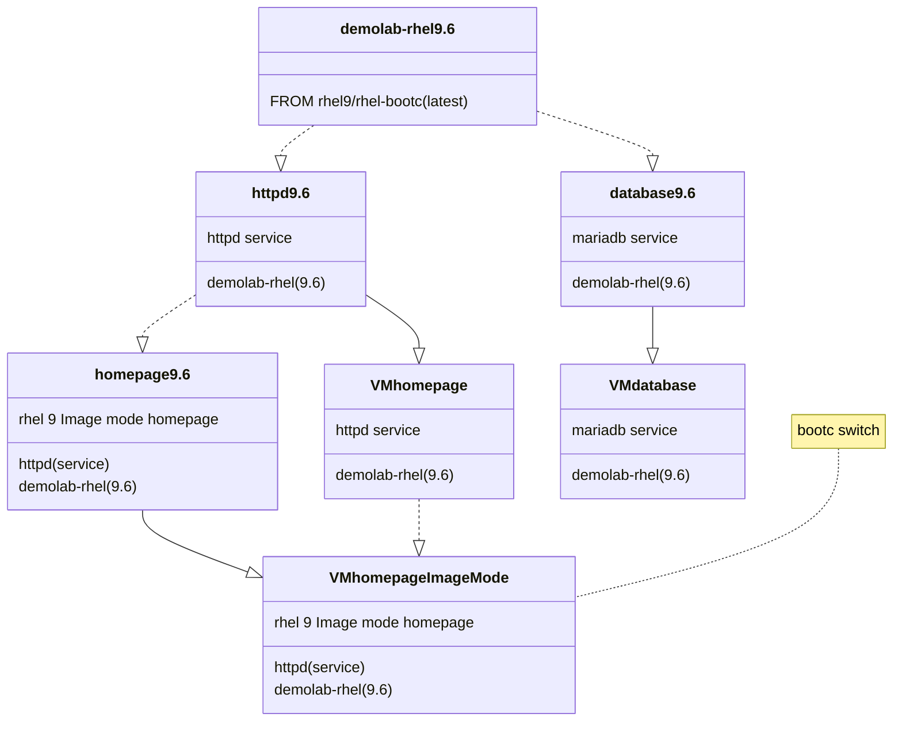
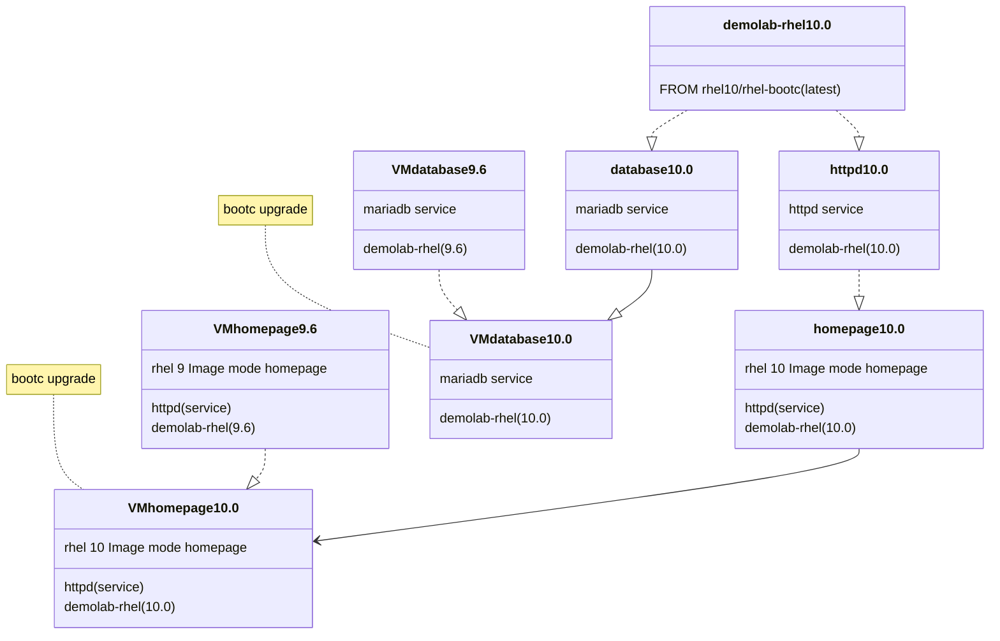
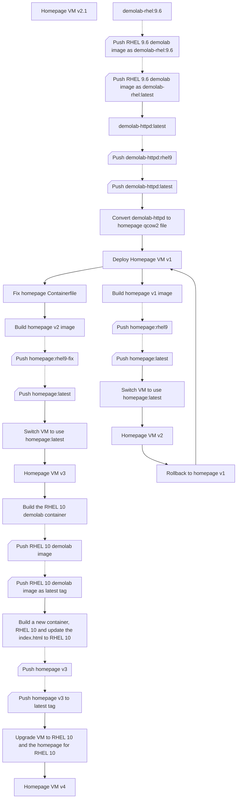

# Ways of working with Image Mode for RHEL

Image Mode Demo scripts, Containerfiles (Dockerfiles), webpages and workflows to demonstrate and understand how to workflow a "day in the life" Linux system administrator.
Draft container files, index.html, and config files to get an Image Mode workshop story going.

The core of this demonstration is how to create a "golden image" or a base image that can be reused in all RHEL deployments and become the standard operating environment. This is based on a tree, or inheritance, structure where the services, and more specifically the sytemd services are build on top of the base image. These services can be a web server, database server, application servers and more. From these services images we will deploy the virtual machines, bare metal servers, edge devices and more.

Why, do we start here and not with the base image? The services images will have the correct file and configuration structures in the base. If we deploy the VMs from the base image and then switch or upgrade to the services image, the VM will may have missing services file strucutres and config files that needs to be in the /var and /etc directories but aren't written during a bootc switch or upgrade command.

Once the services VM has been deployed we can then create the application images and pull them from the registry to the VM to make the VM funcational. In this demo we will do this for a homepage that we will upgrade during the process. We will start by deploying a very simple web page for the httpd service image. We will upgrade the homepage with content describing Image Mode for RHEL 9. At the same time we will use the base RHEL 9 image to create a database image and deploy it to a VM.

Then we will create a new RHEL 10 base image which we will use to upgrade the http and database services images, and when we then deploy a new web page for RHEL 10 we will pull the new RHEL 10 base as part of the upgrade. Similar we will do a more simple upgrade for the database.

## The Build

The registry that we use will be Red Hat Quay, and throughout the instructions we will be referring to will be `quay.io\$QUAY_USER` where `$QUAY_USER` is a variable to store your Quay userid. If you have your own registry or have access to your corporate registry we highly recommend that you use it, as this will be the closest to your environment when you start to build your own images.

The first build will be on RHEL 9.6 where we build a base `demolab-rhel:9.6` image. We then build a second pair of images for our specific services, the httpd and mariadb services. Now we can deploy these services images to Virtual Machines. We then create a new homepage image that has more details on Image Mode, and use the `bootc switch` command to update our VM to the latest home page.

Next we create a new RHEL 10.0 base image, from which we will upgrade our Virtual Machines. We need to go through the same steps, create an updated pair of services images for the httpd and mariadb services. We can upgrade our database service using `bootc upgrade` but before we upgrade our homepage Virtual Machine we also want to update the content to RHEL 10. We update our html source and build a new homepage image and then `bootc upgrade` our virtual machine.

## The workflow

The overall plan of the workflow is to create a base RHEL "golden image" that we will call `demolab-rhel` and will base all our Virtual Machine (VM) KVM deployments from this image.
We will be deploying an httpd server as we can visually see the updates we are doing. This is based on our `demolab-rhel` image and we will add the httpd service and a homepage that we will upgrade in the process, and with the upgrades also upgrade our RHEL release.

The diagram below shows the various flows that can be used during this demo.

There is additional optional parts that is described in the next section. First, there is a flow for minor release upgrades that can be incorporated into the overall workflow. Second, we use the `demolab-rhel` base image to deploy a `demolab-database` server and maintain it the same way as our `demolab-homepage` server.
As a future aspect I want to add an Ansible playbook to use Ansible automation to upgrade the servers.

The flow is as follow:

1. Create a RHEL 9.6 base image and add a user that is part of the wheel group and push that image to the registry as our 9.6 and latest images.
2. Create our application images and VMs.
    1. Create a httpd server image based on our RHEL 9.6 base image adding the Apache httpd service.
    2. Create a MariaDB server image based on our RHEL 9.6 base image
3. Deploy the application images as a virtual machine servers.
    1. Pull and convert the httpd:latest image to our new Homepage virtual machine server.
    2. Pull and convert the mariadb:latest image to our new Database virtual machine server.
    3. Create qcow2 disk VM files from the images in the registry.
    4. Copy the disk images to our KVM pool and create new Virtual machines.
    5. Start the virtual machines and log into the VMs.
        1. Open the URL to the homepage VM in a browser.
4. Create the new homepage image and switch the VM to the homepage image.
    1. Build the new homepage image and tag it as version 1 and latest.
    2. Push the homepage image to the registry as version 1 and latest.
    3. In the homepage VM we deployed in step 3 switch to the new homepage image in the registry.
    4. Reboot the VM
    5. Refresh the homepage in the browser. This should be broken and we should receive a 404.
5. Rollback to get our old homepage back up and running.
    1. In the homepage VM issue the rollback command.
    2. Reboot the VM and after it booted make sure that the old homepage is running.
6. Fix the error in the homepage container file and push the updated image.
    1. Fix the FROM registry in the Container file.
    2. Build a new version of the homepage image and push it as a new version and the latest version.
    3. In the Homepage VM run the bootc switch command again to load the new homepage.
    4. Reboot the VM and this time the new homepage should disply in the browser.
7. Optional: Upgrade the Database server. This shows how different application servers are updated when the latest base RHEL image is updated.
    1. Using the same MariaDB Container file, create a new database image version and push it to a new version and latest.
    2. Upgrade the Database Virtual Machine and reboot.
8. Upgrade the base RHEL image to RHEL 10.
    1. Build a new RHEL 10 OS image tagging it as the RHEL 10 and latest images.
    2. Push the RHEL 10 and latest images to the registry.
9. Build a new version of the httpd service image.
    1. Build a new version of the httpd service image and tag it as the next version and latest. This will automatically use the latest RHEL image and upgrade the httpd service to RHEL 10.
    2. Push the new httpd version to the registry tagging it as the next version and the latest version.
9. Upgrade the homepage from the RHEL 9 welcome page to the new RHEL 10 homepage. As we do the upgrade of the homepage we will also pull in the RHEL 10.0 latest base image as the latest tag of the RHEL image is pointing to the RHEL 10 image. Push the upgrades to our registry as a new homepage version and the latest tag.
    1. Build a new version of the homepage using the homepage upgrade container file that contains the new RHEL 10 web page.
    2. Push the new homepage image to the registry using the next version number and latest as tags.
10. Upgrade the Homepage VM to the latest RHEL version (RHEL 10) and reboot.
    1. Use the bootc upgrade command in the Homepage VM to pull the new layers from the registry and reboot.
    2. Check that the OS release is RHEL 10 and that the homepage is updated in a browser.
11. Optional: Upgrade the Database server. This shows how different application servers are updated to a new RHEL release when the latest base RHEL image is upgraded.
    1. Using the same MariaDB Container file, create a new database image version and push it to a new version and latest.
    2. Upgrade the Database Virtual Machine and reboot.

### Optional additions to the workflow

This optional part to the workflow allows you to start with an early release of RHEL 9.6 and go through a minor release upgrade and CVE updates.
