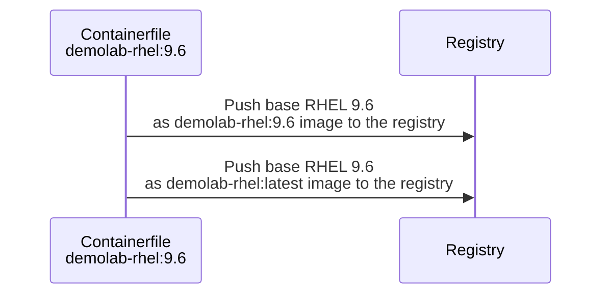
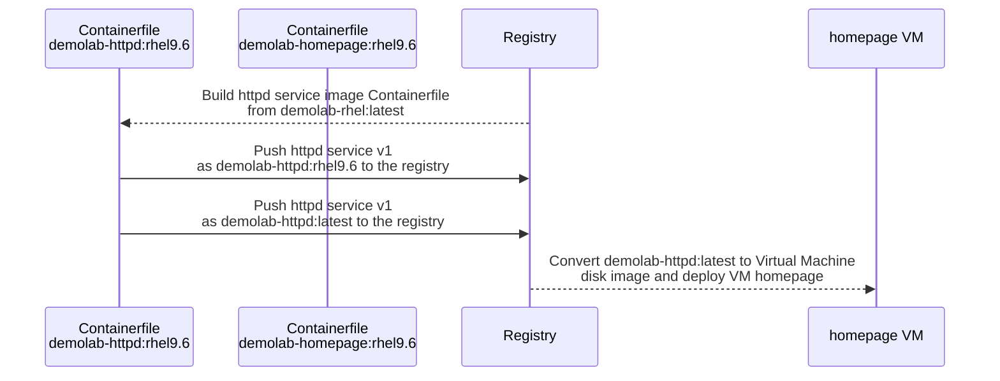
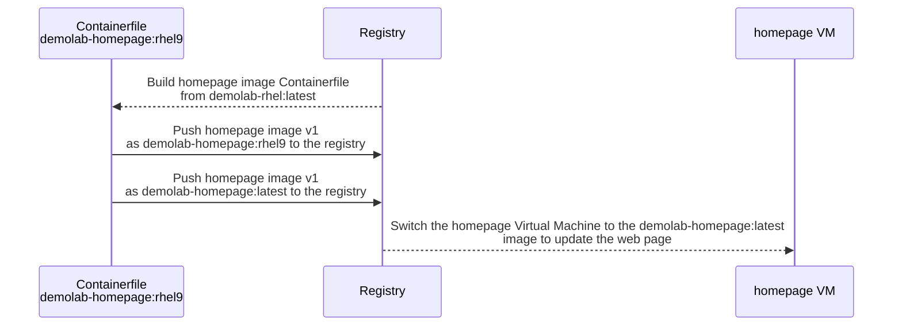
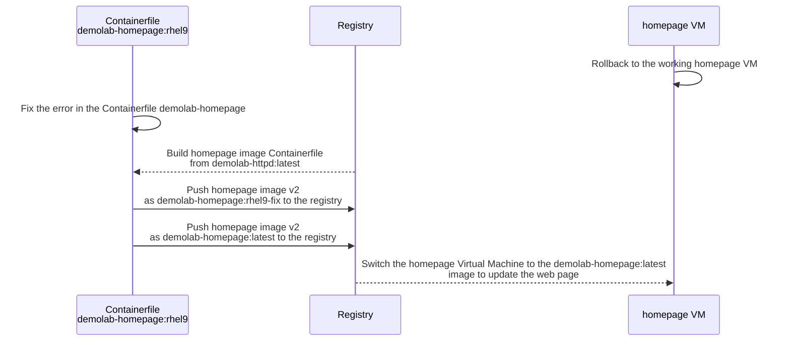
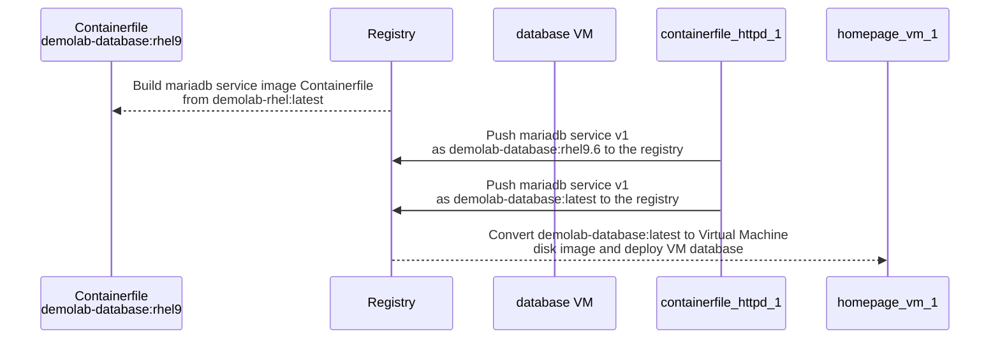

## Build the demo base image for RHEL

The first steps we will build our base (golden) image that we are going to use within the workshop. We will start with RHEL 9.6 and during the workshop update to RHEL 10.0.

This sequence diagram show the steps that we are going to take.



We will name our base (golden) image `demolab-rhel:9.6` and also tag it as our latest rhel base image as `demolab-rhel:latest`.

1. Use podman to build our corporate or demolab base RHEL "golden image". Change to the folder where you have cloned this repo and use `podman build` to build the image from the `Containerfile`.

```bash
cd $HOME/redhat-image-mode-demo/use-cases/way-of-woking-rhel-im/demolab-rhel9.6
```

```bash
podman build -t quay.io/$QUAY_USER/demolab-rhel:latest -t quay.io/$QUAY_USER/demolab-rhel:9.6 -f Containerfile
```

2. If we want to test our image we can run it in a container. You can log in with user `bootc-user` and password `redhat` and run `curl localhost` to test if the httpd service is running and you can see the base image welcome page. You can stop and exit the container with `sudo halt`. We are going to run our container in the next step to check that the httpd service is running and that we can see our homepage before deploying it to a VM.

```bash
podman run -it --rm --name demolab-rhel-96 -p 8080:80 quay.io/$QUAY_USER/demolab-rhel:9.6
```

3. Push the demolab base rhel image to our registry.

```bash
podman push quay.io/$QUAY_USER/demolab-rhel:latest && podman push quay.io/$QUAY_USER/demolab-rhel:9.6
```

!!! tip
    In the optional steps we base the initial image on an older release of RHEL 9.6 so that we can demonstrate the upgrade process to the latest release and how to create base images based on a tested timestamp.
    In the optional section we create our base images for RHEL 9.6 on a specific version, for example `rhel:9.6-1747275992` and push this version to the registry as `demolab-rhel:9.6-1747275992` to reflect the version.

## Deploying the Homepage Virtual Machine

The following sequence diagram shows the steps that we will take to deploy our Homepage VM from the base image. We will name the VM as `homepage` and start to build



We need to create an image for our httpd service based on the RHEL 9 base image we created in the previous step.
We will name our httpd service image `demolab-httpd:rhel9.6` and also tag it as our latest rhel base image as `demolab-httpd:latest`.

1. Use podman to build httpd service image. Change to the folder where you have cloned this repo and use `podman build` to build the image from the `Containerfile`.

```bash
cd $HOME/redhat-image-mode-demo/use-cases/way-of-woking-rhel-im/httpd-service
```

```bash
podman build -t quay.io/$QUAY_USER/demolab-httpd:latest -t quay.io/$QUAY_USER/demolab-httpd:rhel9.6 -f Containerfile
```

2. Push the demolab httpd service image to our registry.

```bash
podman push quay.io/$QUAY_USER/demolab-httpd:latest && podman push quay.io/$QUAY_USER/demolab-httpd:rhel9.6
```

3. If we want to test our image we can run it in a container.
```bash
podman run -it --rm --name demolab-httpd-96 -p 8080:80 quay.io/$QUAY_USER/demolab-httpd:rhel9.6
```

4. You can log in with user `bootc-user` and password `redhat` and run `curl localhost` to test if the httpd service is running and you can see the base image welcome page. You can stop and exit the container with `sudo halt`. You can test the homepage in a browser on the local machine by using the URL `http://localhost:8080`

Now we are ready to create the virtual machine disk image that we are going to import into our new VM.

In some cases the podman command is unable to initially pull the image from the registry and returns an error that you have to pull the image from the registry before building the disk. Use a pull command to syncronise the local images.

1. Since we need to run podman as root to build the virtual machine qcow2 image file, we need to pull the image as root.

```bash
sudo podman pull quay.io/$QUAY_USER/demolab-httpd:latest
```

2. We need to use podman to run the Image Mode virtual machine disk builder to pull the image from the registry and create the virtual machine disk file.

```bash
sudo podman run \
--rm \
-it \
--privileged \
--pull=newer \
--security-opt label=type:unconfined_t \
-v $(pwd)/config.toml:/config.toml:ro \
-v $(pwd):/output \
-v /var/lib/containers/storage:/var/lib/containers/storage registry.redhat.io/rhel9/bootc-image-builder:latest \
--type qcow2 \
quay.io/$QUAY_USER/demolab-httpd:latest
```

3. We will copy the new disk image to the libvirt images pool.

!!! tip
    You can move the disk image if you don't plan to use it for another VM using the mv command.

```bash
sudo cp ./qcow2/disk.qcow2 /var/lib/libvirt/images/homepage.qcow2
```

4. Create the VM from the copied virtual machine image qcow2 file. We will give it 4GB of RAM and set the boot option to UEFI.

```bash
sudo virt-install \
  --connect qemu:///system \
  --name homepage \
  --import \
  --boot uefi \
  --memory 4096 \
  --graphics none \
  --osinfo rhel9-unknown \
  --noautoconsole \
  --noreboot \
  --disk /var/lib/libvirt/images/homepage.qcow2
```

5. Start the VM.

```bash
sudo virsh start homepage
```

6. Login via ssh. You can use the following command that will get the IP address from virsh and log you in.

```bash
VM_IP=$(sudo virsh -q domifaddr homepage | awk '{ print $4 }' | cut -d"/" -f1) && ssh bootc-user@$VM_IP
```

7. You can run a `curl localhost` to check if the httpd service with our base image homepage is working. Exit the VM with `exit`, `logout` or Ctrl-d.

8. Since we are going to refer to the quay.io registry, let us add $QUAY_USER to our .bashrc file.

```bash
sed -i '/unset rc[^\n]*/,$!b;//{x;//p;g};//!H;$!d;x;iQUAY_USER="your quay.io username not the email address"' .bashrc
```

9. and reload the .bashrc file to bring QUAY_USER into the variables.

```bash
source .bashrc
```

10. Finally for this section run the bootc status command to view the booted image registry source and the RHEL version.

```bash
sudo bootc status
```

```
    Booted image: quay.io/$QUAY_USER/demolab-rhel:9.6 \
    Digest: sha256:a48811e05........... \
    Version: 9.6 (2025-07-21 13:10:35.887718188 UTC)
```

Our virtual machine based on Image Mode is now running and we are ready to make updates to the web page.

## Update the Homepage VM to our Image Mode web page

The next steps we will update the web page in our `homepage` VM from the basic RHEL webpage that we created to an more updated web page showing the advantages of using Image Mode.

The following sequence diagram shows the steps that we will take to deploy our Homepage VM from the base image. We will name the VM as `homepage` and start to build



On our image builder server we will build a new Image Mode for RHEL 9 homepage image that we will deploy to the VM.

1. Change directory to the new web page Container file and the *RHEL 9 Image Mode* web page at `homepage-rhel9`. You can open the `index.html` file in the `html` directory to see the updates to the homepage.

```bash
cd cd $HOME/redhat-image-mode-demo/use-cases/way-of-woking-rhel-im/homepage-create
```

2. Build the new homepage images from the `Containerfile`.

```bash
podman build -t quay.io/$QUAY_USER/demolab-homepage:rhel9 -t quay.io/$QUAY_USER/demolab-homepage:latest -f Containerfile
```

3. Push the image to the registry using the `demolab-homepage:rhel9` and `demopage-homepage:latest` tags.

```bash
podman push quay.io/$QUAY_USER/demolab-homepage:latest && podman push quay.io/$QUAY_USER/demolab-homepage:rhel9
```

4. Switch to the Homepage virtual machine and login to the `homepage` VM using ssh.

```bash
VM_IP=$(sudo virsh -q domifaddr homepage | awk '{ print $4 }' | cut -d"/" -f1) && ssh bootc-user@$VM_IP
```

5. We are now going to use the `bootc switch` command to switch the virtual machine to the homepage image in the registry.

!!! tip
    If you didn't add the `$QUAY_USER` to the `.bashrc` file then run the following

```bash
QUAY_USER="your quay.io username not the email address"
```

```bash
sudo bootc switch quay.io/$QUAY_USER/demolab-homepage:latest
```

6. Let us check the we have staged the new homepage image in the virtual machine.

```bash
sudo bootc status
```

```
    Staged image: quay.io/$QUAY_USER/homepage:latest \
            Digest:  sha256:2be7b1...... \
        Version: 9.6 (2025-07-21 15:43:03.624175287 UTC) \
        \
    ● Booted image: quay.io/$QUAY_USER/demolab-rhel:9.6 \
            Digest: sha256:a48811...... \
        Version: 9.6 (2025-07-21 13:10:35.887718188 UTC)
```
7. and we check that we have the old RHEL 9 homepage without our new Image Mode content.

```bash
curl localhost
```

8. We need to reboot the virtual machine to activate the new layers and have our new home page.

```bash
sudo reboot
```

9. Login to the virtual machine to verify that we have a new updated Image Mode homepage.

```bash
VM_IP=$(sudo virsh -q domifaddr homepage | awk '{ print $4 }' | cut -d"/" -f1) && ssh bootc-user@$VM_IP
curl localhost
```

10. Something went wrong! Our httpd service has failed during the update! Let us check the service.

```bash
sudo systemctl status httpd
```

11. There is no httpd service. We will rollback in the next section and fix the problem.

## Rollback and fix our homepage

In the previous section the httpd service wasn't in the image. This is due to a mistake we made in the Containerfile. First we will rollback so that we have the old homepage up and running and then we will fix the problem.



On our image builder server we will build a new Image Mode for RHEL 9 homepage image that we will deploy to the VM.

1. If you aren't in the `homepage-rhel9` directory then change directory to the new web page Container file and the updated web page at `homepage-rhel9`. You can open the `index.html` file in the `html` directory to see the updates to the homepage.

```bash
cd cd $HOME/redhat-image-mode-demo/use-cases/way-of-woking-rhel-im/homepage-create
```

2. We need to fix the Containerfile to pull the correct image from the registry. Use an editor to change the following line to

```
FROM quay.io/$QUAY_USER/demolab-rhel:latest
```

change to

```
FROM quay.io/$QUAY_USER/demolab-httpd:latest
```

3. Build the new homepage images from the `Containerfile` and tag to a new version `homepage:rhel9-fix`.

```bash
podman build -t quay.io/$QUAY_USER/demolab-homepage:rhel9-fix -t quay.io/$QUAY_USER/demolab-homepage:latest -f Containerfile
```

4. Push the image to the registry using the `demolab-homepage:rhel9-fix` and `demopage-homepage:latest` tags.

```bash
podman push quay.io/$QUAY_USER/demolab-homepage:latest && podman push quay.io/$QUAY_USER/demolab-homepage:rhel9-fix
```

5. Switch to the Homepage virtual machine and login to the `homepage` VM using ssh.

```bash
VM_IP=$(sudo virsh -q domifaddr homepage | awk '{ print $4 }' | cut -d"/" -f1) && ssh bootc-user@$VM_IP
```

6. We are now going to use the `bootc switch` command to switch the virtual machine to the homepage image in the registry.

!!! tip
    If you didn't add the `$QUAY_USER` to the `.bashrc` file then run the following

```bash
QUAY_USER="your quay.io username not the email address"
```
```bash
sudo bootc switch quay.io/$QUAY_USER/demolab-homepage:latest
```

7. Let us check the we have staged the new homepage image in the virtual machine.

```bash
sudo bootc status
```

```
    Staged image: quay.io/$QUAY_USER/homepage:latest \
            Digest:  sha256:2be7b1...... \
        Version: 9.6 (2025-07-21 15:43:03.624175287 UTC) \
        \
    ● Booted image: quay.io/$QUAY_USER/demolab-rhel:9.6 \
            Digest: sha256:a48811...... \
        Version: 9.6 (2025-07-21 13:10:35.887718188 UTC)
```

8. and we check that we have the old RHEL 9 homepage without our new Image Mode content.

```bash
curl localhost
```

9. We need to reboot the virtual machine to activate the new layers and have our new home page.

```bash
sudo reboot
```

10. Login to the virtual machine to verify that we have a new updated Image Mode homepage.

```bash
VM_IP=$(sudo virsh -q domifaddr homepage | awk '{ print $4 }' | cut -d"/" -f1) && ssh bootc-user@$VM_IP
```

```bash
curl localhost
```

## Build the database virtual machine

We will then deploy a new virtual machine named `database` as this will be our new demo database server.
We will build the two images in one linked command and push it as the version 1 and latest images to our registry.



We are following a less complex deployment for the database server than the deployment we did for the homepage.
We are going to deploy the mariadb service using a bash script to automate the deployment.

In the `mariadb_service` directory we need to update the QUAY_USER variable with your quay user id.

1. Change to the `mariadb-service` directory.

```bash
cd $HOME/redhat-image-mode-demo/use-cases/way-of-woking-rhel-im/mariadb-service
```

2. Ensure that the `mariadb-deploy.sh` file is executable.

```bash
chmod +x mariadb-deploy.sh
```

3. Edit the mariadb-deploy.sh file and change the entry for the QUAY_USER to your quay.io user name.

4. Run the bash script `mariadb-deploy.sh` to create the database images and the database VM.

```bash
./mariadb_deploy.sh
```