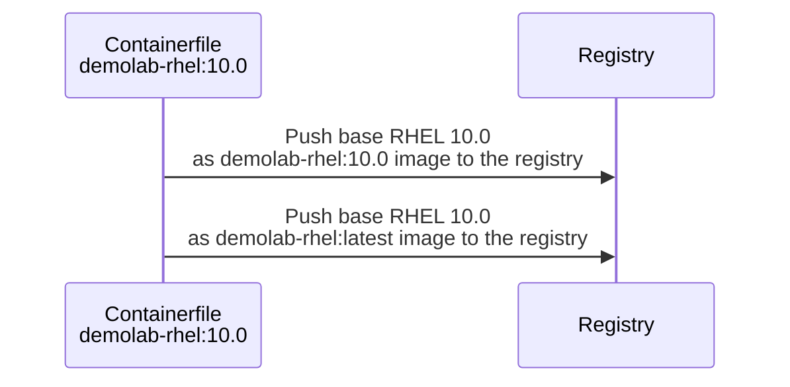
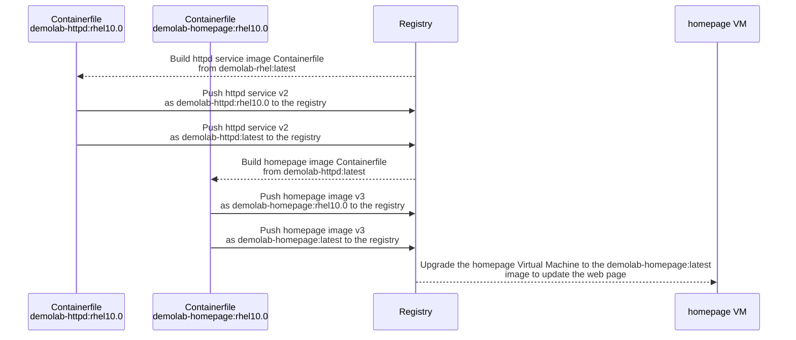
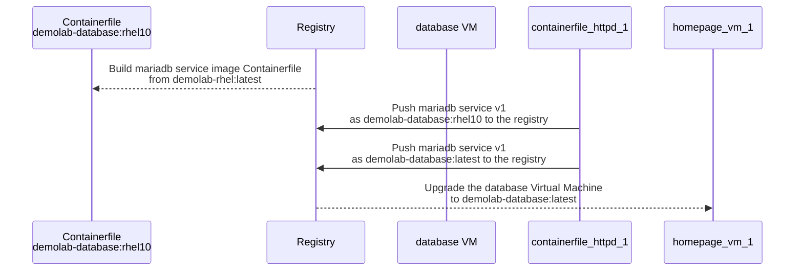

## Create a new RHEL 10 base image

We are going to create a new demolab-rhel base image that is based on the latest RHEL, version 10. This base image we are going to use to upgrade our services, httpd and mariadb. We created a new RHEL 10 homepage and then will upgrade the VMs to RHEL 10.



1. Change to the RHEL 10 Container file directory to build the new RHEL 10 base image.

    ```bash
    cd cd $HOME/redhat-image-mode-demo/use-cases/way-of-woking-rhel-im/demolab-rhel10.0
    ```

2. Use Podman build to build the new RHEL 10 image and tag it as `demolab-rhel:latest` and `demolab-rhel:10.0`.

    ```bash
    podman build -t quay.io/$QUAY_USER/demolab-rhel:latest -t quay.io/$QUAY_USER/demolab-rhel:10.0 -f Containerfile
    ```

3. Push the new images to the registry.

    ```bash
    podman push quay.io/$QUAY_USER/demolab-rhel:latest && podman push quay.io/$QUAY_USER/demolab-rhel:10.0
    ```

## Upgrade the VM to RHEL 10 and update the homepage

Next we are going to build the httpd services image on RHEL 10 and upgrade the homepage VM.



1. Change directory to the httpd-service directory. Since we base our httpd image on the latest tagged RHEL base image in the repository, we can reuse the same Container file.

    ```bash
    cd cd $HOME/redhat-image-mode-demo/use-cases/way-of-woking-rhel-im/httpd-service
    ```

2. Use Podman build to build the new httpd images and we will tag the images as `demolab-httpd:latest` and `demolab-httpd:rhel10.0`. It is best practice to tag these images with version numbers or date stamps, but for the demo it makes it easier to track the RHEL version we are using.

    ```bash
    podman build -t quay.io/$QUAY_USER/demolab-httpd:latest -t quay.io/$QUAY_USER/demolab-httpd:rhel10.0 -f Containerfile
    ```

3. Push the new httpd services to the registry.

    ```bash
    podman push quay.io/$QUAY_USER/demolab-httpd:latest && podman push quay.io/$QUAY_USER/demolab-httpd:rhel10.0
    ```

4. Change to the homepage-rhel10 directory. This has an updated homepage for RHEL 10 with RHEL 10 logos.

    ```bash
    cd cd $HOME/redhat-image-mode-demo/use-cases/way-of-woking-rhel-im/homepage-rhel10
    ```

5. Build the new homepage images with the tags `demolab-homepage:latest` and `demolab-homepage:rhel10`. We fixed the ContainerFile in the previous section, and it will now use the httpd image and deploy correctly.

    ```bash
    podman build -t quay.io/$QUAY_USER/demolab-homepage:latest -t quay.io/$QUAY_USER/demolab-homepage:rhel10 -f Containerfile
    ```

6. Push the updated homepage images to the registry.

    ```bash
    podman push quay.io/$QUAY_USER/demolab-homepage:latest && podman push quay.io/$QUAY_USER/demolab-homepage:rhel10
    ```

7. No we switch to the `homepage` VM, we will use our special ssh command to log into the VM.

    ```bash
    VM_IP=$(sudo virsh -q domifaddr homepage | awk '{ print $4 }' | cut -d"/" -f1) && ssh bootc-user@$VM_IP
    ```

8. Let's check if there is an update in the registry using the `bootc upgrade --check` command.

    ```bash
    sudo bootc upgrade --check
    ```

    ```
        Update available for: docker://quay.io/$QUAY_USER/homepage:latest \
        Version: 10.0 \
        Digest: sha256:0c5416...... \
        Total new layers: 77    Size: 885.4 MB \
        Removed layers:   76    Size: 1.4 GB \
        Added layers:     76    Size: 885.4 MB
    ```

9. Apply the upgrage to our VM. This may take a while as we are pulling RHEL 10 and the homepage updates in one go.

    ```bash
    sudo bootc upgrade
    ```

10. Use `bootc status` to check that we have an update and that is shows that the update RHEL version is version 10.

    ```bash
    sudo bootc status
    ```

    ```
        Staged image: quay.io/$QUAY_USER/homepage:latest \
                Digest: sha256:0c5416...... \
            Version: 10.0 (2025-07-21 17:25:47.229186615 UTC) \
        \
        ● Booted image: quay.io/$QUAY_USER/homepage:latest \
                Digest: sha256:2be7b1...... \
            Version: 9.6 (2025-07-21 15:43:03.624175287 UTC) \
        \
        Rollback image: quay.io/$QUAY_USER/demolab-rhel:latest \
                Digest: sha256:7c46d6...... \
                Version: 9.6 (2025-07-21 16:04:36.100285429 UTC)
    ```

11. Reboot the VM to change to the new homepage and run RHEL 10!

    ```bash
    sudo reboot
    ```

12. We use our special ssh command again to log into the VM.

    ```bash
    VM_IP=$(sudo virsh -q domifaddr homepage | awk '{ print $4 }' | cut -d"/" -f1) && ssh bootc-user@$VM_IP
    ```

13. and check the OS version using `bootc status`

    ```bash
    sudo bootc status
    ```

14. Finally use the VMs ip address and go to the web site to confirm the web page upgrade showing RHEL 10 logos.

This is to show how we update the base OS on an existing deployment. Usually this will be done during an application, or in this case, a homepage update.

## Upgrade the database server to RHEL 10

Similar we are going to build the database services image on RHEL 10 and upgrade the database VM. Since we don't have any application tied to the database we can upgrade our database VM directly from the database services image.



1. Change directory to the mariadb-service directory. Since we base our database service image on the latest tagged RHEL base image in the repository, we can reuse the same Container file.

    ```bash
    cd cd $HOME/redhat-image-mode-demo/use-cases/way-of-woking-rhel-im/mariadb-service
    ```

2. Use Podman build to build the new httpd images and we will tag the images as `demolab-database:latest` and `demolab-database:rhel10`. It is best practice to tag these images with version numbers or date stamps, but for the demo it makes it easier to track the RHEL version we are using.

    ```bash
    podman build -t quay.io/$QUAY_USER/demolab-database:latest -t quay.io/$QUAY_USER/demolab-database:rhel10.0 -f Containerfile
    ```

3. Push the new httpd services to the registry.

    ```bash
    podman push quay.io/$QUAY_USER/demolab-database:latest && podman push quay.io/$QUAY_USER/demolab-database:rhel10.0
    ```

4. No we switch to the database VM, we will use our special ssh command to log into the VM.

    ```bash
    VM_IP=$(sudo virsh -q domifaddr database | awk '{ print $4 }' | cut -d"/" -f1) && ssh bootc-user@$VM_IP
    ```

5. Let's check if there is an update in the registry using the `bootc upgrade --check` command.

    ```bash
    sudo bootc upgrade --check
    ```

    ```
        Update available for: docker://quay.io/$QUAY_USER/demolab-database:latest \
        Version: 10.0 \
        Digest: sha256:0c5416...... \
        Total new layers: 77    Size: 885.4 MB \
        Removed layers:   76    Size: 1.4 GB \
        Added layers:     76    Size: 885.4 MB
    ```

6. Apply the upgrage to our VM. This may take a while as we are pulling RHEL 10 and the homepage updates in one go. Using  `--apply` the VM will be rebooted after the upgrade is done.

    ```bash
    sudo bootc upgrade --apply
    ```

7. Use our special ssh command to log into the VM again.

    ```bash
    VM_IP=$(sudo virsh -q domifaddr database | awk '{ print $4 }' | cut -d"/" -f1) && ssh bootc-user@$VM_IP
    ```

8. Use `bootc status` to check that we have an update and that is shows that the update RHEL version is version 10.

    ```bash
    sudo bootc status
    ```

    ```
        Staged image: quay.io/$QUAY_USER/homepage:latest \
                Digest: sha256:0c5416...... \
            Version: 10.0 (2025-07-21 17:25:47.229186615 UTC) \
        \
        ● Booted image: quay.io/$QUAY_USER/homepage:latest \
                Digest: sha256:2be7b1...... \
            Version: 9.6 (2025-07-21 15:43:03.624175287 UTC) \
        \
        Rollback image: quay.io/$QUAY_USER/demolab-rhel:latest \
                Digest: sha256:7c46d6...... \
                Version: 9.6 (2025-07-21 16:04:36.100285429 UTC)
    ```

9. Finally check that mariadb is running.

    ```bash
    sudo systemctl status mariadb
    ```

10. We can also check the Linux OS version.

    ```bash
    cat /etc/redhat-release
    ```

## Conclusion

This concludes the workshop exercises. We encourage you to try different services and applications based on the base image `demolab-rhel` that we used in these exercise. We also encourage you to build your own base or corporate image and build and deploy servers using it. You can use Podman Desktop for many of the executions that we did in the command line, and using a desktop approach may be easier for you. Finally, we didn't incorporate any pipelines or CI/CD flows in these examples and using these tools to test and deploy updates makes the task of a system administrator a lot easier. Our Youtube channel "Into the Terminal" episode 151 has a great introduction to this.
